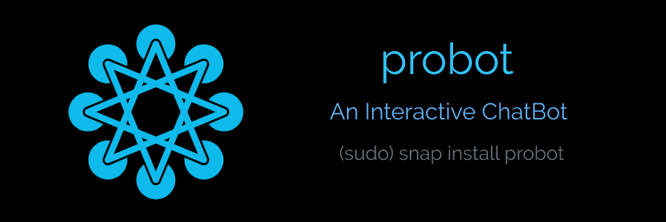

# ProBot  
  

ProBot is an interactive ChatBot to help with day to day tasks on general desktop and mobile environments.  
Use `dbus-launch sudo probot` to be able to access all features like running applications out of the strict confinement sandbox.  

# Build  
ProBot is built with:  
Python    
NLTK  
Kivy  

Containerized with:
Snapcraft sandbox with `strict` confinements.  

To Rebuild:  
Make suitable changes as you feel like to the codebase, and then use `snapcraft` in the root directory to rebuild a snap.  

# Contributing  
Feel free to edit the application and then make a pull request.  
